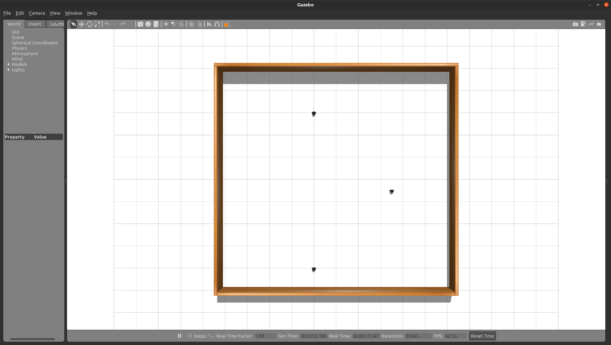
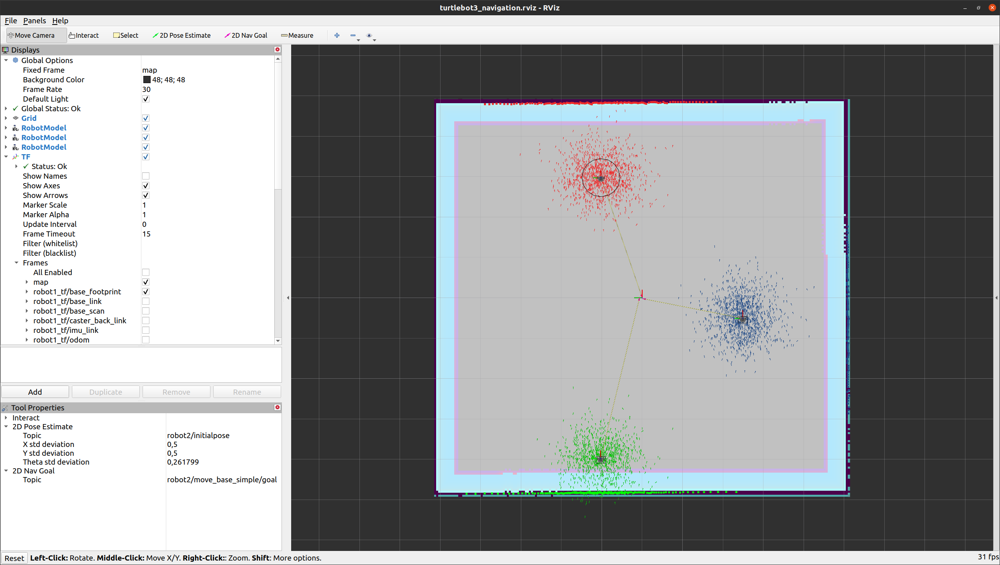
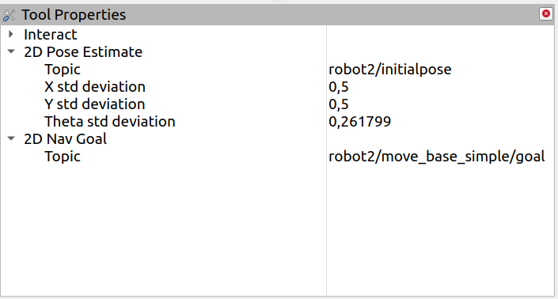
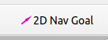
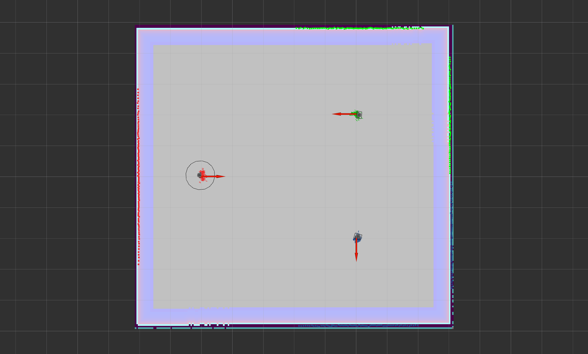

# Navigate Multiple Turtlebots


## Getting Started

### Clone the repository
```
cd ~/catkin_ws/src
git clone https://github.com/Barath19/Navigate_Multiple_Turtlebots/tree/master
```
### Building the package
```
cd ..
catkin build
```

### Running the package

Open a new terminal (Source the workspace)
```
roslaunch multi_turtlebots_sim main.launch
```

Open another terminal (Source the workspace)
```
roslaunch multi_turtlebots_nav navigation.launch 
```



## Localization using AMCL

- Once the rviz is opened, use the ``` Tool Properties ``` panel to set the robot initial pose and robot goal pose to respective robot's namespace. E.g. for ``` robot2 ```


- Set the 2D navigation goal for the selected robot.



### Repeat the above two localization steps for all the robots, Until the particles converge.

